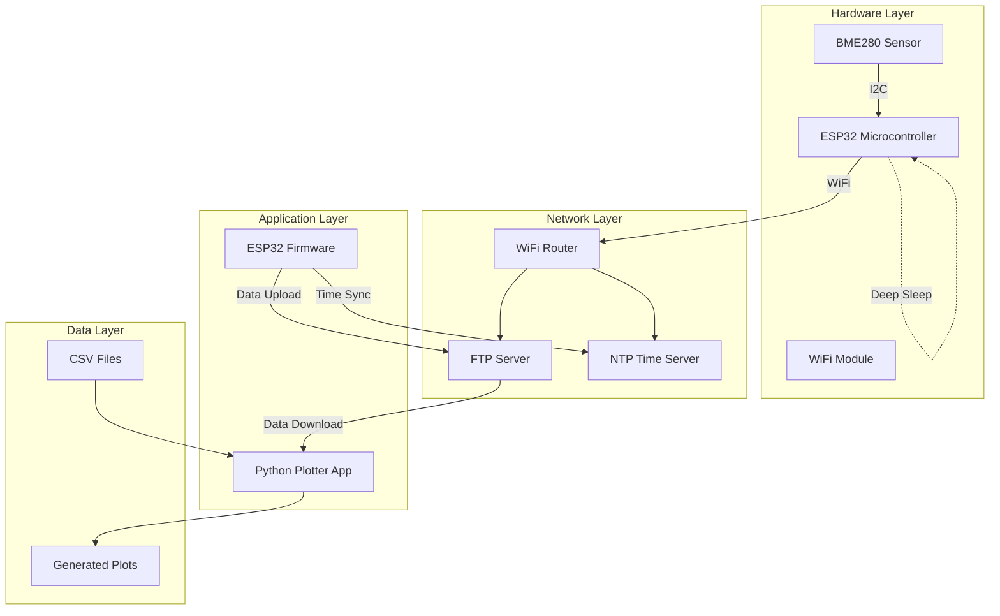
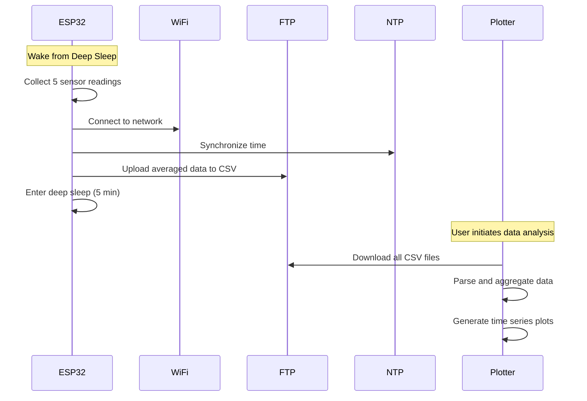

# High-Level Design (HLD) - Environmental Monitoring System

## System Overview

The Environmental Monitoring System is a distributed IoT solution that collects, stores, and visualizes environmental data using an ESP32 microcontroller and a desktop visualization application.

## Architecture Diagram

## System Components

### 1. Sensor Node (ESP32)
**Purpose**: Autonomous environmental data collection
- **Hardware**: ESP32 + BME280 sensor
- **Power Management**: Deep sleep cycles (5-minute intervals)
- **Communication**: WiFi for data upload and time synchronization
- **Data Storage**: Temporary in-memory aggregation

### 2. Data Storage (FTP Server)
**Purpose**: Centralized data repository
- **Protocol**: FTP for file transfer
- **Format**: Daily CSV files with timestamped readings
- **Organization**: Date-based file naming (DD_MM_YYYY.csv)

### 3. Visualization Application (Python)
**Purpose**: Data analysis and presentation
- **Interface**: Desktop GUI (PyQt5)
- **Capabilities**: Data download, filtering, plotting, export
- **Charts**: Time series for temperature, humidity, pressure

## Data Flow

## Key Design Decisions

### Power Efficiency
- **Deep Sleep**: 5-minute cycles minimize power consumption
- **Batch Processing**: Multiple readings per wake cycle
- **WiFi Management**: Connect only when needed, then disconnect

### Data Reliability
- **Retry Mechanisms**: FTP upload attempts with fallback
- **Data Validation**: Sensor reading verification before upload
- **Timestamp Accuracy**: NTP synchronization for accurate logging

### Scalability
- **Modular Design**: FTP client as separate class
- **Configurable Parameters**: Easy modification of timing and network settings
- **Extensible Format**: CSV structure supports additional sensor types

## System Interfaces

### Hardware Interfaces
- **I2C**: ESP32 ↔ BME280 (SDA: GPIO21, SCL: GPIO22)
- **WiFi**: ESP32 ↔ Network infrastructure
- **Power**: USB/Battery input to ESP32

### Software Interfaces
- **FTP Protocol**: File transfer between ESP32 and server
- **NTP Protocol**: Time synchronization
- **CSV Format**: Structured data exchange
- **GUI Events**: User interaction with plotter application

## Performance Characteristics

### ESP32 Node
- **Data Collection**: 5 readings per 5-minute cycle
- **Active Time**: ~30 seconds per cycle
- **Sleep Current**: <10μA in deep sleep
- **Upload Success Rate**: >95% with retry mechanism

### Visualization App
- **Data Processing**: Handles months of historical data
- **Plot Generation**: Real-time rendering for selected date ranges
- **Memory Usage**: Efficient pandas operations for large datasets

## Error Handling Strategy

### ESP32 Firmware
- **Sensor Failures**: Graceful degradation with error logging
- **Network Issues**: Retry with exponential backoff
- **FTP Errors**: Multiple upload attempts before sleep
- **Time Sync**: Continue with system time if NTP fails

### Plotter Application
- **Connection Errors**: User-friendly error messages
- **Data Parsing**: Robust CSV handling with validation
- **GUI Exceptions**: Graceful error recovery
- **File Operations**: Safe file handling with proper cleanup

## Security Considerations

### Network Security
- **WPA2/WPA3**: Secure WiFi connection
- **FTP Credentials**: Configurable authentication
- **Local Network**: Assumes trusted internal network

### Data Privacy
- **No Personal Data**: Only environmental readings collected
- **Local Processing**: Data analysis performed locally
- **Configurable Storage**: User controls data retention

## Future Enhancements

### Hardware
- **Multi-Sensor Support**: Additional environmental sensors
- **Battery Monitoring**: Power level reporting
- **Solar Power**: Renewable energy integration

### Software
- **Database Storage**: Replace FTP with proper database
- **Web Interface**: Browser-based monitoring
- **Mobile App**: Remote monitoring capabilities
- **Data Analytics**: Machine learning for pattern recognition

## System Requirements

### Minimum Hardware
- ESP32 development board
- BME280 sensor breakout
- 3.3V power supply (USB or battery)
- WiFi network with internet access

### Software Dependencies
- PlatformIO development environment
- Python 3.7+ with PyQt5
- FTP server (router built-in or dedicated)
- Windows/Linux/macOS for plotter application
