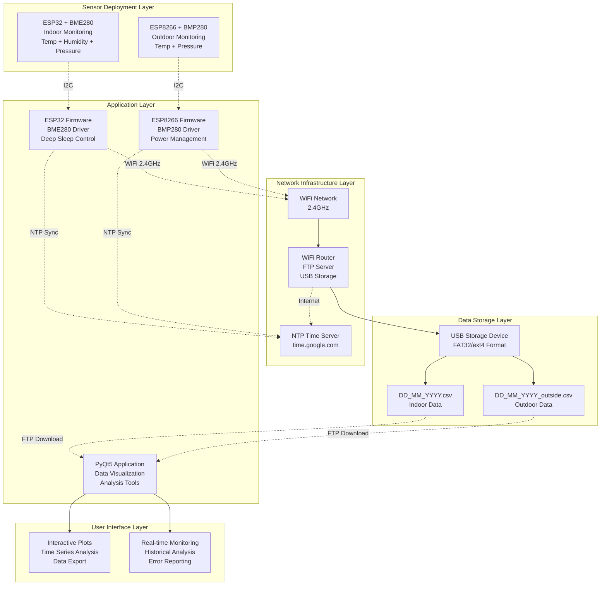
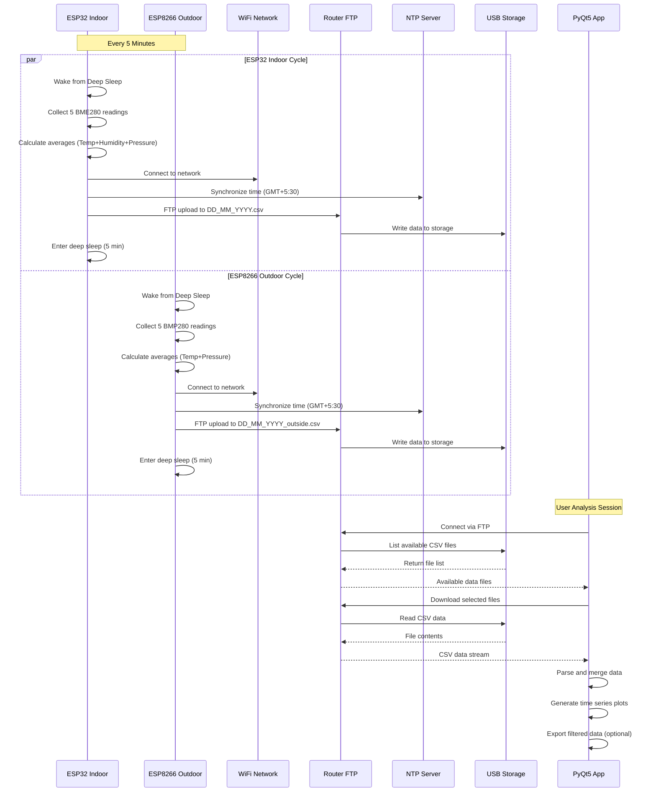

# High-Level Design (HLD) - Environmental Monitoring System

## Executive Summary

The Environmental Monitoring System is a distributed IoT solution that provides cost-effective, long-term environmental data collection using ESP32/ESP8266 microcontrollers and router-based FTP storage. The system is designed for minimal power consumption, maximum reliability, and professional data visualization.

## System Overview

This dual-platform environmental monitoring system enables deployment of multiple sensor nodes (indoor/outdoor) with centralized data storage and analysis. The architecture prioritizes simplicity, cost-effectiveness, and long-term operation without requiring dedicated server infrastructure.

## Architecture Diagram

## System Components

### 1. ESP32 Indoor Sensor Node
**Purpose**: High-precision indoor environmental monitoring
- **Hardware Platform**: ESP32 WROOM-32 with Denky32 development board
- **Sensor Integration**: BME280 for temperature, humidity, and pressure measurement
- **Power Profile**: Deep sleep optimization for battery operation (3-6 months)
- **Communication**: WiFi 802.11b/g/n (2.4GHz) with WPA2/WPA3 security
- **Data Format**: CSV files named `DD_MM_YYYY.csv`
- **I2C Configuration**: SDA=GPIO21, SCL=GPIO22, Clock=100kHz

### 2. ESP8266 Outdoor Sensor Node  
**Purpose**: Weather-resistant outdoor environmental monitoring
- **Hardware Platform**: ESP8266 NodeMCU v2 development board
- **Sensor Integration**: BMP280 for temperature and pressure measurement
- **Power Profile**: Ultra-low power deep sleep for extended outdoor operation (4-8 months)
- **Communication**: WiFi 802.11b/g/n (2.4GHz only) with WPA2 security
- **Data Format**: CSV files named `DD_MM_YYYY_outside.csv`
- **I2C Configuration**: SDA=GPIO5 (D1), SCL=GPIO4 (D2), Clock=100kHz

### 3. Router-Based FTP Storage
**Purpose**: Centralized, always-available data repository
- **Hardware**: Consumer WiFi router with USB port support
- **Storage Medium**: USB 3.0 flash drive or external USB storage
- **File System**: FAT32 (universal compatibility) or ext4 (Linux routers)
- **FTP Service**: Built-in router FTP server functionality
- **Access Control**: User authentication with configurable permissions
- **Capacity**: Unlimited expansion through USB storage upgrades

### 4. Python Visualization Application
**Purpose**: Professional data analysis and visualization platform
- **GUI Framework**: PyQt5 for cross-platform desktop interface
- **Data Processing**: Pandas for efficient time-series data manipulation
- **Visualization Engine**: Matplotlib for publication-quality plots
- **Network Client**: Custom FTP client for automated data synchronization
- **Export Capabilities**: CSV export for external analysis tools
- **Platform Support**: Windows, Linux, macOS compatibility

## Data Flow Architecture

## Key Design Decisions

### Multi-Platform Architecture
- **Unified Codebase**: Single firmware supporting both ESP32 and ESP8266 platforms
- **Sensor Abstraction**: Conditional compilation for BME280 vs BMP280 sensors
- **Platform-Specific Optimization**: Tailored power management for each platform
- **Differentiated Data Streams**: File naming convention separates indoor/outdoor data

### Router-Centric Storage Strategy
- **Infrastructure Reuse**: Leverages existing router hardware for data storage
- **Cost Optimization**: Eliminates need for dedicated server or cloud subscriptions
- **Reliability**: Router-based storage provides 24/7 availability
- **Scalability**: USB storage capacity easily expandable
- **Security**: Data remains within local network perimeter

### Power-First Design Philosophy
- **Deep Sleep Priority**: Minimum wake time with maximum sleep duration
- **Peripheral Management**: Dynamic WiFi/Bluetooth control for power savings
- **Sensor Efficiency**: Optimized I2C communication and sampling strategies
- **Battery Life Target**: 3-8 months operation on single battery charge

### Fault-Tolerant Communication
- **Multiple Retry Strategies**: Exponential backoff for network operations
- **Graceful Degradation**: System continues operation despite component failures
- **Comprehensive Logging**: Detailed error reporting for troubleshooting
- **Connection Resilience**: Automatic recovery from network interruptions

## System Interfaces

### Hardware Interfaces
- **I2C**: ESP32 ↔ BME280 (SDA: GPIO21, SCL: GPIO22)
- **WiFi**: ESP32 ↔ Network infrastructure
- **Power**: USB/Battery input to ESP32

### Software Interfaces
- **FTP Protocol**: File transfer between ESP32 and server
- **NTP Protocol**: Time synchronization
- **CSV Format**: Structured data exchange
- **GUI Events**: User interaction with plotter application

## Performance Characteristics

### ESP32 Node
- **Data Collection**: 5 readings per 5-minute cycle
- **Active Time**: ~30 seconds per cycle
- **Sleep Current**: <10μA in deep sleep
- **Upload Success Rate**: >95% with retry mechanism

### Visualization App
- **Data Processing**: Handles months of historical data
- **Plot Generation**: Real-time rendering for selected date ranges
- **Memory Usage**: Efficient pandas operations for large datasets

## Error Handling Strategy

### ESP32 Firmware
- **Sensor Failures**: Graceful degradation with error logging
- **Network Issues**: Retry with exponential backoff
- **FTP Errors**: Multiple upload attempts before sleep
- **Time Sync**: Continue with system time if NTP fails

### Plotter Application
- **Connection Errors**: User-friendly error messages
- **Data Parsing**: Robust CSV handling with validation
- **GUI Exceptions**: Graceful error recovery
- **File Operations**: Safe file handling with proper cleanup

## Security Considerations

### Network Security
- **WPA2/WPA3**: Secure WiFi connection
- **FTP Credentials**: Configurable authentication
- **Local Network**: Assumes trusted internal network

### Data Privacy
- **No Personal Data**: Only environmental readings collected
- **Local Processing**: Data analysis performed locally
- **Configurable Storage**: User controls data retention

## Future Enhancements

### Hardware
- **Multi-Sensor Support**: Additional environmental sensors
- **Battery Monitoring**: Power level reporting
- **Solar Power**: Renewable energy integration

### Software
- **Database Storage**: Replace FTP with proper database
- **Web Interface**: Browser-based monitoring
- **Mobile App**: Remote monitoring capabilities
- **Data Analytics**: Machine learning for pattern recognition

## System Requirements

### Software Dependencies

### Firmware Platforms
- **PlatformIO Framework**: Modern Arduino IDE alternative with library management
- **ESP32 Arduino Core**: Espressif's Arduino framework for ESP32 platform
- **ESP8266 Arduino Core**: Community-maintained Arduino framework for ESP8266
- **Adafruit Sensor Libraries**: Hardware abstraction layer for BME280/BMP280

### Python Application Stack
- **PyQt5**: Cross-platform GUI toolkit with native look and feel
- **Matplotlib**: Publication-quality plotting with extensive customization
- **Pandas**: High-performance data analysis and manipulation library
- **Python Standard Library**: Built-in FTP, threading, and date/time support

## System Scalability & Future Enhancements

### Horizontal Scaling
- **Multiple Sensor Nodes**: Unlimited sensor deployment with unique file suffixes
- **Geographical Distribution**: Sensors across different locations/buildings
- **Network Segmentation**: Support for multiple router/FTP server configurations

### Vertical Scaling
- **Enhanced Sensors**: Additional environmental parameters (CO2, UV, light)
- **Database Integration**: Replace FTP with proper time-series database (InfluxDB)
- **Cloud Connectivity**: MQTT broker integration for remote monitoring
- **Web Dashboard**: Browser-based monitoring interface

### Advanced Features
- **Machine Learning**: Predictive analytics for environmental trends
- **Alert System**: Threshold-based notifications via email/SMS
- **Data Aggregation**: Automatic averaging for long-term trend analysis
- **Mobile Application**: Native iOS/Android apps for remote monitoring

## System Reliability & Maintenance

### Built-in Reliability Features
- **Automatic Recovery**: Self-healing network connections and FTP operations
- **Data Validation**: Multi-level error checking from sensor to storage
- **Graceful Degradation**: System continues operation despite component failures
- **Comprehensive Logging**: Detailed error reporting for troubleshooting

### Maintenance Requirements
- **USB Storage**: Periodic cleanup of old data files (automated script available)
- **Battery Replacement**: 3-8 month intervals depending on usage patterns
- **Firmware Updates**: Over-the-air (OTA) updates for feature enhancements
- **Network Configuration**: Occasional WiFi credential updates

### Monitoring & Diagnostics
- **Health Monitoring**: Sample size tracking indicates sensor/network health
- **Performance Metrics**: Upload success rates and timing statistics
- **Error Tracking**: Detailed logging for proactive issue resolution
- **Capacity Planning**: Storage usage monitoring and growth projections

## Conclusion

The Environmental Monitoring System represents a practical solution for long-term environmental data collection that balances cost, reliability, and functionality. The router-centric architecture eliminates traditional server infrastructure while providing enterprise-grade data reliability through redundant error handling and recovery mechanisms.

The dual-platform approach (ESP32/ESP8266) enables flexible deployment strategies while the professional Python visualization application provides powerful data analysis capabilities. This system demonstrates how modern IoT solutions can be built using consumer-grade hardware without sacrificing reliability or functionality.

**Key Success Factors:**
- **Simplicity**: Minimal infrastructure requirements with maximum functionality
- **Reliability**: Robust error handling and automatic recovery mechanisms  
- **Scalability**: Easy expansion through additional sensor nodes
- **Cost-Effectiveness**: Leverages existing network infrastructure
- **Professional Visualization**: Enterprise-quality data analysis tools

The system is well-suited for applications ranging from personal environmental monitoring to small-scale research projects and building management systems.
