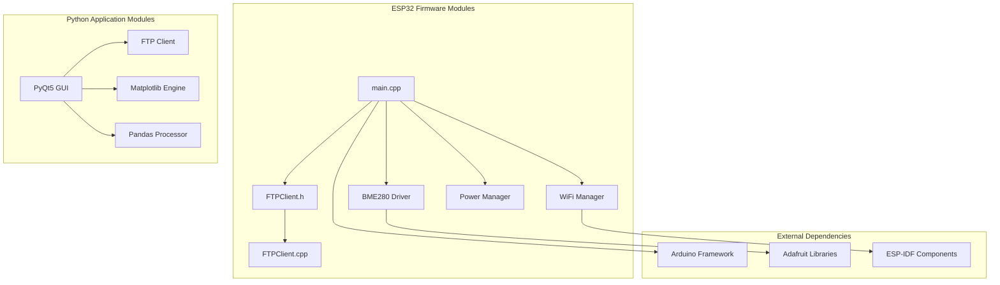
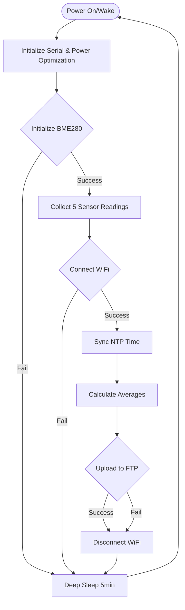
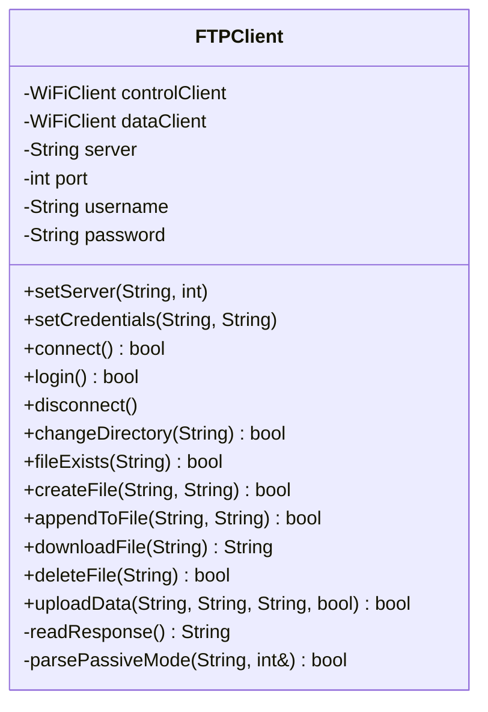
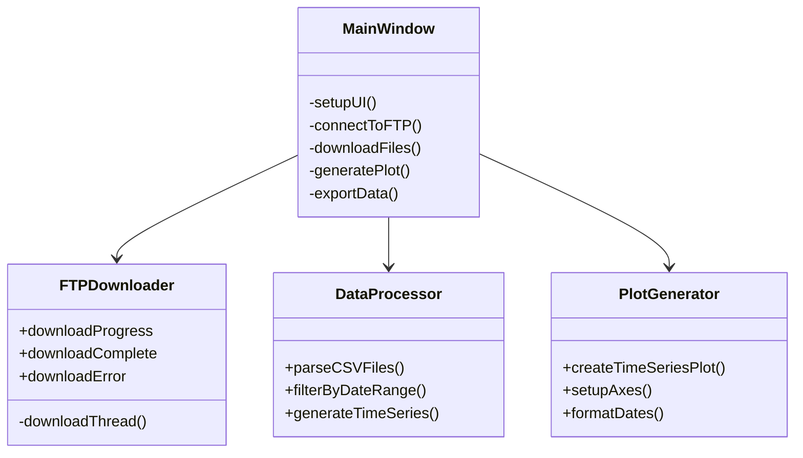

# Low-Level Design (LLD) - Environmental Monitoring System

## Module-Level Architecture



## ESP32 Firmware Design

### Main Application Flow



### Core Functions

#### 1. setup()
```cpp
void setup() {
    Serial.begin(SERIAL_BAUD);
    optimizePowerConsumption();     // Disable BT, manage WiFi
    
    if (!initializeBME280()) {
        goToSleep();
        return;
    }
    
    collectSensorReadings();        // Gather 5 samples
    
    if (!connectToWiFi()) {
        goToSleep();
        return;
    }
    
    syncTime();                     // NTP synchronization
    
    // Calculate averages and upload
    float avgTemp = tempSum / sampleCount;
    float avgPressure = pressureSum / sampleCount;
    float avgHumidity = humiditySum / sampleCount;
    
    uploadDataToFTP(avgTemp, avgPressure, avgHumidity);
    
    // Cleanup and sleep
    WiFi.disconnect(true);
    goToSleep();
}
```

#### 2. BME280 Initialization
```cpp
bool initializeBME280() {
    Wire.begin(SDA_PIN, SCL_PIN);
    Wire.setClock(I2C_CLOCK);
    
    // Try primary address (0x76)
    if (!bme.begin(BME280_ADDR_PRIMARY, &Wire)) {
        // Try secondary address (0x77)
        if (!bme.begin(BME280_ADDR_SECONDARY, &Wire)) {
            return false;
        }
    }
    
    // Configure sensor settings
    bme.setSampling(SENSOR_MODE, TEMP_OVERSAMPLING, 
                   PRESSURE_OVERSAMPLING, HUMIDITY_OVERSAMPLING, 
                   FILTER_SETTING, STANDBY_TIME);
    
    delay(WARMUP_TIME);
    return true;
}
```

#### 3. Data Collection
```cpp
void collectSensorReadings() {
    tempSum = 0;
    pressureSum = 0;
    humiditySum = 0;
    sampleCount = 0;
    
    for (int i = 0; i < READINGS_PER_CYCLE; i++) {
        float temperature = bme.readTemperature();
        float pressure = bme.readPressure() / 100.0F;  // Pa to hPa
        float humidity = bme.readHumidity();
        
        // Validate readings
        if (!isnan(temperature) && !isnan(pressure) && !isnan(humidity)) {
            tempSum += temperature;
            pressureSum += pressure;
            humiditySum += humidity;
            sampleCount++;
        }
        
        delay(READING_INTERVAL);
    }
}
```

### FTPClient Class Design



#### Key FTP Operations

##### File Upload Strategy
```cpp
bool uploadData(String basePath, String filename, String csvData, bool createHeader) {
    // Retry mechanism (2 attempts)
    for (int attempt = 1; attempt <= 2; attempt++) {
        if (!connect() || !login() || !changeDirectory(basePath)) {
            continue;  // Retry
        }
        
        bool exists = fileExists(filename);
        
        if (exists) {
            // Download existing content
            String existingContent = downloadFile(filename);
            String fullContent = existingContent + csvData;
            
            // Delete and recreate with appended data
            if (deleteFile(filename) && createFile(filename, fullContent)) {
                return true;
            }
        } else {
            // Create new file with optional header
            String fullContent = createHeader ? 
                "Date,Sample Size,Temp (°C),Pressure (hPa),Humidity (RH%)\r\n" + csvData : 
                csvData;
            
            if (createFile(filename, fullContent)) {
                return true;
            }
        }
    }
    return false;
}
```

##### Passive Mode Data Transfer
```cpp
bool createFile(String filename, String content) {
    // Set binary mode
    controlClient.printf("TYPE I\r\n");
    readResponse();
    
    // Enter passive mode
    controlClient.printf("PASV\r\n");
    String response = readResponse();
    
    int dataPort;
    if (!parsePassiveMode(response, dataPort)) {
        return false;
    }
    
    // Establish data connection
    if (dataClient.connect(server.c_str(), dataPort)) {
        controlClient.printf("STOR %s\r\n", filename.c_str());
        String storResponse = readResponse();
        
        if (storResponse.startsWith("150") || storResponse.startsWith("125")) {
            dataClient.print(content);
            dataClient.flush();
            dataClient.stop();
            
            String finalResponse = readResponse();
            return finalResponse.startsWith("226") || finalResponse.startsWith("250");
        }
    }
    return false;
}
```

## Python Plotter Application Design

### Application Architecture



### Key Data Structures

#### CSV Data Format
```python
DataFrame columns:
- Date: datetime64[ns]         # Parsed timestamp
- Sample Size: int64           # Number of readings averaged
- Temp (°C): float64          # Temperature in Celsius
- Pressure (hPa): float64     # Atmospheric pressure
- Humidity (RH%): float64     # Relative humidity percentage
```

#### Application State
```python
class ApplicationState:
    ftp_config = {
        'server': '192.168.1.1',
        'port': 21,
        'username': 'admin',
        'password': '',
        'directory': '/data/'
    }
    
    data_files = []               # List of downloaded CSV files
    combined_data = None          # Pandas DataFrame
    available_dates = []          # Date range for selection
    selected_start_date = None
    selected_end_date = None
```

### Critical Algorithms

#### Data Aggregation
```python
def parse_csv_files(file_list):
    all_data = []
    
    for file_path in file_list:
        try:
            # Read CSV with proper parsing
            df = pd.read_csv(file_path, parse_dates=['Date'], 
                           date_parser=lambda x: pd.to_datetime(x, format='%d/%m/%Y %H:%M'))
            
            # Validate required columns
            required_cols = ['Date', 'Sample Size', 'Temp (°C)', 'Pressure (hPa)', 'Humidity (RH%)']
            if all(col in df.columns for col in required_cols):
                all_data.append(df)
            
        except Exception as e:
            logger.error(f"Failed to parse {file_path}: {e}")
    
    if all_data:
        combined = pd.concat(all_data, ignore_index=True)
        return combined.sort_values('Date').reset_index(drop=True)
    
    return pd.DataFrame()
```

#### Plot Generation
```python
def create_time_series_plot(data, start_date, end_date):
    fig, axes = plt.subplots(2, 2, figsize=(15, 10))
    fig.suptitle(f'Environmental Data: {start_date} to {end_date}')
    
    # Filter data by date range
    mask = (data['Date'] >= start_date) & (data['Date'] <= end_date)
    filtered_data = data.loc[mask]
    
    # Temperature plot
    axes[0,0].plot(filtered_data['Date'], filtered_data['Temp (°C)'], 'r-', linewidth=1)
    axes[0,0].set_title('Temperature (°C)')
    axes[0,0].grid(True, alpha=0.3)
    
    # Humidity plot
    axes[0,1].plot(filtered_data['Date'], filtered_data['Humidity (RH%)'], 'b-', linewidth=1)
    axes[0,1].set_title('Humidity (RH%)')
    axes[0,1].grid(True, alpha=0.3)
    
    # Pressure plot
    axes[1,0].plot(filtered_data['Date'], filtered_data['Pressure (hPa)'], 'g-', linewidth=1)
    axes[1,0].set_title('Pressure (hPa)')
    axes[1,0].grid(True, alpha=0.3)
    
    # Sample size plot
    axes[1,1].plot(filtered_data['Date'], filtered_data['Sample Size'], 'm-', linewidth=1)
    axes[1,1].set_title('Sample Size')
    axes[1,1].grid(True, alpha=0.3)
    
    # Format all x-axes
    for ax in axes.flat:
        ax.tick_params(axis='x', rotation=45)
        ax.xaxis.set_major_formatter(DateFormatter('%d/%m %H:%M'))
    
    plt.tight_layout()
    return fig
```

## Memory Management

### ESP32 Memory Usage
- **Stack**: ~8KB for function calls and local variables
- **Heap**: ~200KB available, minimal dynamic allocation
- **PSRAM**: Not used in this design
- **Flash**: ~1MB for firmware + OTA partition

### Data Storage Strategy
- **Temporary Variables**: Stack allocation for sensor readings
- **String Operations**: Minimal heap allocation for FTP operations
- **Deep Sleep**: All RAM contents lost, no persistent memory required

### Python Memory Optimization
- **Pandas DataFrames**: Efficient columnar storage
- **Lazy Loading**: Load only selected date ranges
- **Garbage Collection**: Explicit cleanup of large objects
- **Streaming**: Process FTP downloads incrementally

## Error Handling Patterns

### ESP32 Error Recovery
```cpp
// Retry pattern with exponential backoff
bool retryOperation(std::function<bool()> operation, int maxAttempts) {
    for (int attempt = 1; attempt <= maxAttempts; attempt++) {
        if (operation()) {
            return true;
        }
        
        if (attempt < maxAttempts) {
            int delayMs = 1000 * (1 << (attempt - 1));  // Exponential backoff
            delay(min(delayMs, 10000));  // Cap at 10 seconds
        }
    }
    return false;
}
```

### Python Exception Handling
```python
def safe_ftp_operation(operation):
    try:
        return operation()
    except ftplib.error_perm as e:
        logger.error(f"FTP permission error: {e}")
        raise FTPPermissionError(str(e))
    except ftplib.error_temp as e:
        logger.error(f"FTP temporary error: {e}")
        raise FTPTemporaryError(str(e))
    except Exception as e:
        logger.error(f"Unexpected FTP error: {e}")
        raise FTPGenericError(str(e))
```

## Performance Optimizations

### ESP32 Optimizations
- **I2C Clock**: Optimized to 100kHz for reliable communication
- **WiFi Power**: Disabled when not needed
- **Bluetooth**: Completely disabled to save power
- **CPU Frequency**: Default 240MHz for fast processing

### Python Optimizations
- **Vectorized Operations**: Pandas for efficient data manipulation
- **Qt Threading**: Background FTP operations to prevent GUI blocking
- **Memory Mapping**: Large file processing without loading entire file
- **Caching**: Reuse parsed data when changing date ranges

## Testing Strategy

### Unit Testing
- **ESP32**: Hardware-in-loop testing with mock FTP server
- **Python**: pytest with mock FTP responses
- **Integration**: End-to-end data flow validation

### Validation Points
- **Sensor Accuracy**: Compare with reference instruments
- **Data Integrity**: Checksum validation for FTP transfers
- **Power Consumption**: Measure actual vs. expected current draw
- **GUI Responsiveness**: Performance testing with large datasets
