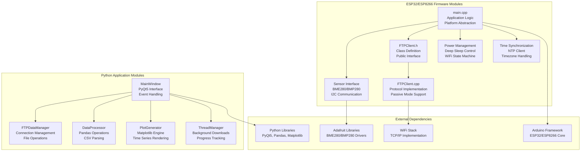
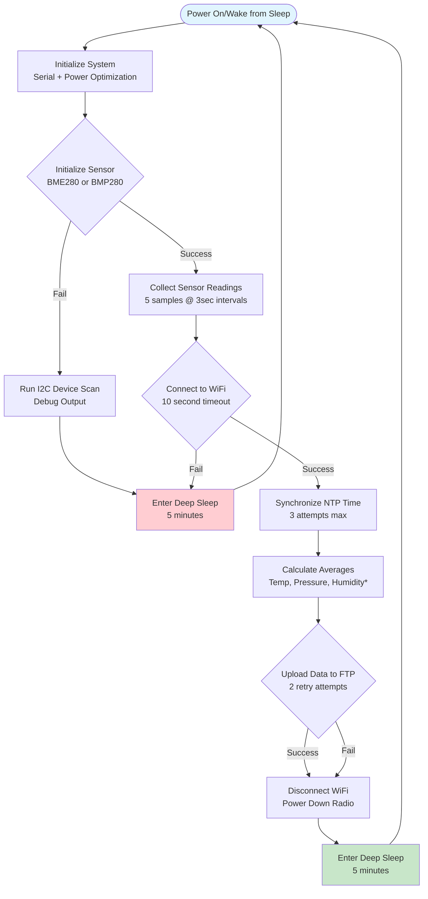
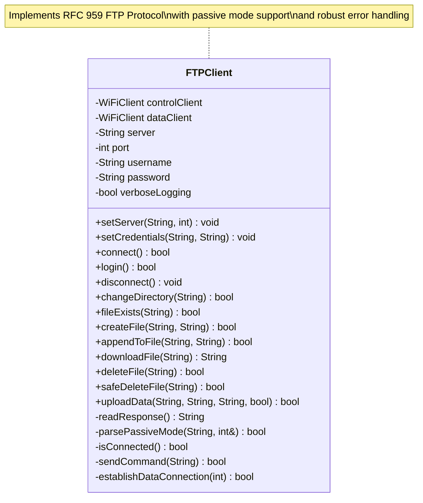
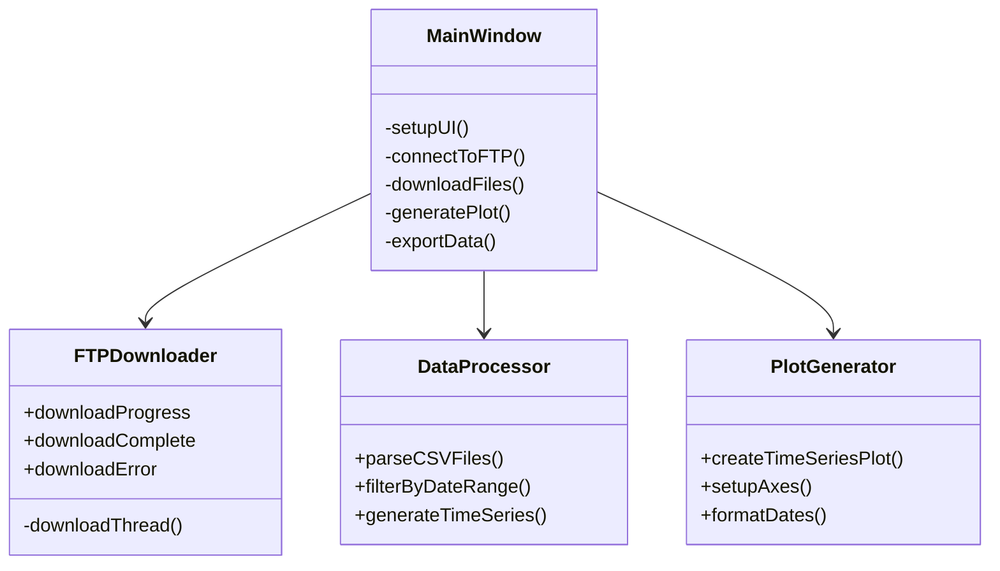

# Low-Level Design (LLD) - Environmental Monitoring System

## Implementation Overview

The Low-Level Design provides detailed implementation specifications for the dual-platform environmental monitoring system, covering ESP32/ESP8266 firmware architecture, Python application design, and inter-component communication protocols.

## Platform-Specific Implementation Matrix

| Component | ESP32 Implementation | ESP8266 Implementation |
|-----------|---------------------|------------------------|
| **Sensor** | BME280 (Temp+Humidity+Pressure) | BMP280 (Temp+Pressure) |
| **I2C Pins** | SDA=GPIO21, SCL=GPIO22 | SDA=GPIO5(D1), SCL=GPIO4(D2) |
| **File Suffix** | None (`DD_MM_YYYY.csv`) | `_outside` (`DD_MM_YYYY_outside.csv`) |
| **Power Profile** | ~10μA sleep, 150-250mA active | ~20μA sleep, 120-200mA active |
| **WiFi Support** | 802.11b/g/n (2.4GHz + 5GHz) | 802.11b/g/n (2.4GHz only) |
| **Additional Features** | Bluetooth (disabled for power) | None |
| **Build Flag** | `-DUSE_BME280=1` | `-DUSE_BMP280=1` |

## Module-Level Architecture



## Firmware Design Architecture

### Application State Machine



*Note: Humidity only available on ESP32+BME280

### Core Function Implementation

#### 1. setup() - Main Application Entry Point
```cpp
void setup() {
    // Phase 1: System Initialization
    Serial.begin(SERIAL_BAUD);                    // 115200 baud rate
    delay(1000);                                  // Allow serial stabilization
    
    // Platform identification and logging
    #ifdef ESP32
    Serial.println("=== ESP32 BME280 Environmental Logger ===");
    Serial.printf("I2C Pins: SDA=%d, SCL=%d\n", SDA_PIN, SCL_PIN);
    #elif defined(ESP8266)  
    Serial.println("=== ESP8266 BMP280 Environmental Logger ===");
    Serial.printf("I2C Pins: SDA=%d (D1), SCL=%d (D2)\n", SDA_PIN, SCL_PIN);
    #endif
    
    // Phase 2: Power Optimization
    optimizePowerConsumption();                   // Disable Bluetooth, optimize WiFi
    
    // Phase 3: Sensor Initialization with Fallback
    if (!initializeBME280()) {
        Serial.println("Sensor initialization failed");
        scanI2CDevices();                         // Debug I2C bus
        goToSleep();                             // Fail-safe sleep
        return;
    }
    
    // Phase 4: Data Collection
    collectSensorReadings();                      // 5 samples with averaging
    
    // Phase 5: Network Operations
    if (!connectToWiFi()) {
        Serial.println("WiFi connection failed");
        goToSleep();
        return;
    }
    
    syncTime();                                   // NTP synchronization (optional)
    
    // Phase 6: Data Processing and Upload
    float avgTemp = tempSum / sampleCount;
    float avgPressure = pressureSum / sampleCount;
    #ifdef USE_BME280
    float avgHumidity = humiditySum / sampleCount;
    #else
    float avgHumidity = 0.0;                     // BMP280 has no humidity
    #endif
    
    uploadDataToFTP(avgTemp, avgPressure, avgHumidity);
    
    // Phase 7: Cleanup and Sleep
    WiFi.disconnect(true);
    WiFi.mode(WIFI_OFF);
    #ifdef ESP32
    esp_wifi_stop();                             // ESP32-specific WiFi shutdown
    #endif
    
    goToSleep();                                 // Enter 5-minute deep sleep
}
```

#### 2. Sensor Initialization with Multi-Address Support
```cpp
bool initializeBME280() {
    // I2C Bus Initialization
    Wire.begin(SDA_PIN, SCL_PIN);                // Platform-specific pins
    Wire.setClock(I2C_CLOCK);                    // 100kHz for reliability
    delay(500);                                  // Sensor stabilization
    
    // Multi-attempt initialization with address fallback
    const int maxAttempts = 3;
    const uint8_t addresses[] = {BME280_ADDR_PRIMARY, BME280_ADDR_SECONDARY};
    
    for (int attempt = 1; attempt <= maxAttempts; attempt++) {
        for (int addrIdx = 0; addrIdx < 2; addrIdx++) {
            uint8_t addr = addresses[addrIdx];
            
            #ifdef USE_BME280
            bool success = bme.begin(addr, &Wire);
            #else
            bool success = bmp.begin(addr);
            #endif
            
            if (success) {
                Serial.printf("Sensor found at 0x%02X on attempt %d\n", addr, attempt);
                
                // Configure sensor parameters
                #ifdef USE_BME280
                bme.setSampling(SENSOR_MODE, TEMP_OVERSAMPLING, PRESSURE_OVERSAMPLING,
                               HUMIDITY_OVERSAMPLING, FILTER_SETTING, STANDBY_TIME);
                #else
                bmp.setSampling(SENSOR_MODE, TEMP_OVERSAMPLING, PRESSURE_OVERSAMPLING,
                               FILTER_SETTING, STANDBY_TIME);
                #endif
                
                delay(WARMUP_TIME);              // 2-second warmup
                
                // Validate with test reading
                #ifdef USE_BME280
                float testTemp = bme.readTemperature();
                float testPressure = bme.readPressure() / 100.0F;
                #else
                float testTemp = bmp.readTemperature();
                float testPressure = bmp.readPressure() / 100.0F;
                #endif
                
                if (!isnan(testTemp) && !isnan(testPressure)) {
                    Serial.printf("Test readings: %.1f°C, %.1fhPa\n", testTemp, testPressure);
                    return true;
                }
            }
        }
        
        if (attempt < maxAttempts) {
            delay(1000);                         // Wait before retry
        }
    }
    
    return false;                                // All attempts failed
}
```

#### 3. Data Collection with Error Handling
```cpp
void collectSensorReadings() {
    tempSum = 0;
    pressureSum = 0;
    humiditySum = 0;
    sampleCount = 0;
    
    Serial.printf("Collecting %d sensor readings...\n", READINGS_PER_CYCLE);
    
    for (int i = 0; i < READINGS_PER_CYCLE; i++) {
        // Platform-specific sensor reading
        #ifdef USE_BME280
        float temperature = bme.readTemperature();
        float pressure = bme.readPressure() / 100.0F;    // Pa to hPa conversion
        float humidity = bme.readHumidity();
        #else
        float temperature = bmp.readTemperature();
        float pressure = bmp.readPressure() / 100.0F;    // Pa to hPa conversion
        float humidity = 0.0;                            // BMP280 has no humidity
        #endif
        
        // Data validation and accumulation
        if (!isnan(temperature) && !isnan(pressure) && 
            temperature > -40 && temperature < 85 &&     // Reasonable temperature range
            pressure > 800 && pressure < 1200) {         // Reasonable pressure range
            
            #ifdef USE_BME280
            if (!isnan(humidity) && humidity >= 0 && humidity <= 100) {
                humiditySum += humidity;
            }
            #endif
            
            tempSum += temperature;
            pressureSum += pressure;
            sampleCount++;
            
            Serial.printf("Reading %d: %.1f°C, %.1fhPa", i+1, temperature, pressure);
            #ifdef USE_BME280
            Serial.printf(", %.2f%%\n", humidity);
            #else
            Serial.println();
            #endif
        } else {
            Serial.printf("Reading %d: Invalid data (skipped)\n", i+1);
        }
        
        if (i < READINGS_PER_CYCLE - 1) {
            delay(READING_INTERVAL);                     // 3-second interval between readings
        }
    }
    
    Serial.printf("Valid readings collected: %d/%d\n", sampleCount, READINGS_PER_CYCLE);
}
```

### Advanced FTP Client Implementation



#### Key FTP Operations Implementation

##### Data Upload Strategy with Retry Logic
```cpp
bool uploadData(String basePath, String filename, String csvData, bool createHeader) {
    const int maxRetries = 2;
    const unsigned long retryDelay = 2000;       // 2 seconds between retries
    
    for (int attempt = 1; attempt <= maxRetries; attempt++) {
        Serial.printf("FTP upload attempt %d/%d for %s\n", attempt, maxRetries, filename.c_str());
        
        // Establish control connection
        if (!connect()) {
            Serial.println("FTP control connection failed");
            if (attempt < maxRetries) delay(retryDelay);
            continue;
        }
        
        // Authenticate with server
        if (!login()) {
            Serial.println("FTP authentication failed");
            disconnect();
            if (attempt < maxRetries) delay(retryDelay);
            continue;
        }
        
        // Navigate to target directory
        if (!changeDirectory(basePath)) {
            Serial.printf("FTP directory change failed: %s\n", basePath.c_str());
            disconnect();
            if (attempt < maxRetries) delay(retryDelay);
            continue;
        }
        
        // Check if file already exists
        bool filePresent = fileExists(filename);
        String finalContent = csvData;
        
        if (filePresent) {
            // Download existing content for appending
            String existingContent = downloadFile(filename);
            if (existingContent.length() > 0) {
                finalContent = existingContent + csvData;
                
                // Use safe delete to handle file locking
                if (!safeDeleteFile(filename)) {
                    Serial.println("Failed to delete existing file for update");
                    disconnect();
                    if (attempt < maxRetries) delay(retryDelay);
                    continue;
                }
            }
        } else if (createHeader) {
            // Add CSV header for new files
            String header = "Date,Sample Size,Temp (°C),Pressure (hPa),Humidity (RH%)\r\n";
            finalContent = header + csvData;
        }
        
        // Upload updated content
        if (createFile(filename, finalContent)) {
            Serial.printf("FTP upload successful: %s (%d bytes)\n", 
                         filename.c_str(), finalContent.length());
            disconnect();
            return true;
        } else {
            Serial.println("FTP file creation failed");
            disconnect();
            if (attempt < maxRetries) delay(retryDelay);
        }
    }
    
    Serial.printf("FTP upload failed after %d attempts\n", maxRetries);
    return false;
}
```

##### Passive Mode Data Transfer
```cpp
bool createFile(String filename, String content) {
    // Set binary transfer mode for data integrity
    controlClient.printf("TYPE I\r\n");
    String typeResponse = readResponse();
    if (!typeResponse.startsWith("200")) {
        Serial.println("Failed to set binary mode");
        return false;
    }
    
    // Enter passive mode for firewall compatibility
    controlClient.printf("PASV\r\n");
    String pasvResponse = readResponse();
    
    int dataPort;
    if (!parsePassiveMode(pasvResponse, dataPort)) {
        Serial.println("Failed to parse passive mode response");
        return false;
    }
    
    // Establish data connection
    if (!dataClient.connect(server.c_str(), dataPort)) {
        Serial.printf("Failed to connect to data port %d\n", dataPort);
        return false;
    }
    
    // Initiate file storage command
    controlClient.printf("STOR %s\r\n", filename.c_str());
    String storResponse = readResponse();
    
    if (storResponse.startsWith("150") || storResponse.startsWith("125")) {
        // Transfer data through data connection
        size_t bytesWritten = dataClient.print(content);
        dataClient.flush();
        dataClient.stop();
        
        Serial.printf("Transferred %d bytes to %s\n", bytesWritten, filename.c_str());
        
        // Wait for transfer completion confirmation
        String finalResponse = readResponse();
        bool success = finalResponse.startsWith("226") || finalResponse.startsWith("250");
        
        if (success) {
            Serial.println("File transfer completed successfully");
        } else {
            Serial.printf("File transfer failed: %s\n", finalResponse.c_str());
        }
        
        return success;
    } else {
        Serial.printf("STOR command failed: %s\n", storResponse.c_str());
        dataClient.stop();
        return false;
    }
}
```

##### Passive Mode Response Parsing
```cpp
bool parsePassiveMode(String response, int& dataPort) {
    // Parse response format: 227 Entering Passive Mode (192,168,1,1,20,40)
    // Port calculation: 20*256 + 40 = 5160
    
    int start = response.indexOf('(');
    int end = response.indexOf(')', start);
    
    if (start == -1 || end == -1) {
        Serial.println("Invalid passive mode response format");
        return false;
    }
    
    String dataInfo = response.substring(start + 1, end);
    Serial.printf("Parsing passive mode data: %s\n", dataInfo.c_str());
    
    // Extract port components from comma-separated values
    int commaPositions[5];
    int commaCount = 0;
    
    for (int i = 0; i < dataInfo.length() && commaCount < 5; i++) {
        if (dataInfo.charAt(i) == ',') {
            commaPositions[commaCount++] = i;
        }
    }
    
    if (commaCount >= 5) {
        // Extract high and low port bytes
        int portHigh = dataInfo.substring(commaPositions[3] + 1, commaPositions[4]).toInt();
        int portLow = dataInfo.substring(commaPositions[4] + 1).toInt();
        
        dataPort = portHigh * 256 + portLow;
        Serial.printf("Calculated data port: %d (high=%d, low=%d)\n", 
                     dataPort, portHigh, portLow);
        
        return (dataPort > 0 && dataPort < 65536);
    }
    
    Serial.printf("Failed to parse passive mode response (found %d commas)\n", commaCount);
    return false;
}
```

## Python Plotter Application Design

### Application Architecture



### Key Data Structures

#### CSV Data Format
```python
DataFrame columns:
- Date: datetime64[ns]         # Parsed timestamp
- Sample Size: int64           # Number of readings averaged
- Temp (°C): float64          # Temperature in Celsius
- Pressure (hPa): float64     # Atmospheric pressure
- Humidity (RH%): float64     # Relative humidity percentage
```

#### Application State
```python
class ApplicationState:
    ftp_config = {
        'server': '192.168.1.1',
        'port': 21,
        'username': 'admin',
        'password': '',
        'directory': '/data/'
    }
    
    data_files = []               # List of downloaded CSV files
    combined_data = None          # Pandas DataFrame
    available_dates = []          # Date range for selection
    selected_start_date = None
    selected_end_date = None
```

### Critical Algorithms

#### Data Aggregation
```python
def parse_csv_files(file_list):
    all_data = []
    
    for file_path in file_list:
        try:
            # Read CSV with proper parsing
            df = pd.read_csv(file_path, parse_dates=['Date'], 
                           date_parser=lambda x: pd.to_datetime(x, format='%d/%m/%Y %H:%M'))
            
            # Validate required columns
            required_cols = ['Date', 'Sample Size', 'Temp (°C)', 'Pressure (hPa)', 'Humidity (RH%)']
            if all(col in df.columns for col in required_cols):
                all_data.append(df)
            
        except Exception as e:
            logger.error(f"Failed to parse {file_path}: {e}")
    
    if all_data:
        combined = pd.concat(all_data, ignore_index=True)
        return combined.sort_values('Date').reset_index(drop=True)
    
    return pd.DataFrame()
```

#### Plot Generation
```python
def create_time_series_plot(data, start_date, end_date):
    fig, axes = plt.subplots(2, 2, figsize=(15, 10))
    fig.suptitle(f'Environmental Data: {start_date} to {end_date}')
    
    # Filter data by date range
    mask = (data['Date'] >= start_date) & (data['Date'] <= end_date)
    filtered_data = data.loc[mask]
    
    # Temperature plot
    axes[0,0].plot(filtered_data['Date'], filtered_data['Temp (°C)'], 'r-', linewidth=1)
    axes[0,0].set_title('Temperature (°C)')
    axes[0,0].grid(True, alpha=0.3)
    
    # Humidity plot
    axes[0,1].plot(filtered_data['Date'], filtered_data['Humidity (RH%)'], 'b-', linewidth=1)
    axes[0,1].set_title('Humidity (RH%)')
    axes[0,1].grid(True, alpha=0.3)
    
    # Pressure plot
    axes[1,0].plot(filtered_data['Date'], filtered_data['Pressure (hPa)'], 'g-', linewidth=1)
    axes[1,0].set_title('Pressure (hPa)')
    axes[1,0].grid(True, alpha=0.3)
    
    # Sample size plot
    axes[1,1].plot(filtered_data['Date'], filtered_data['Sample Size'], 'm-', linewidth=1)
    axes[1,1].set_title('Sample Size')
    axes[1,1].grid(True, alpha=0.3)
    
    # Format all x-axes
    for ax in axes.flat:
        ax.tick_params(axis='x', rotation=45)
        ax.xaxis.set_major_formatter(DateFormatter('%d/%m %H:%M'))
    
    plt.tight_layout()
    return fig
```

## Memory Management

### ESP32 Memory Usage
- **Stack**: ~8KB for function calls and local variables
- **Heap**: ~200KB available, minimal dynamic allocation
- **PSRAM**: Not used in this design
- **Flash**: ~1MB for firmware + OTA partition

### Data Storage Strategy
- **Temporary Variables**: Stack allocation for sensor readings
- **String Operations**: Minimal heap allocation for FTP operations
- **Deep Sleep**: All RAM contents lost, no persistent memory required

### Python Memory Optimization
- **Pandas DataFrames**: Efficient columnar storage
- **Lazy Loading**: Load only selected date ranges
- **Garbage Collection**: Explicit cleanup of large objects
- **Streaming**: Process FTP downloads incrementally

## Error Handling Patterns

### ESP32 Error Recovery
```cpp
// Retry pattern with exponential backoff
bool retryOperation(std::function<bool()> operation, int maxAttempts) {
    for (int attempt = 1; attempt <= maxAttempts; attempt++) {
        if (operation()) {
            return true;
        }
        
        if (attempt < maxAttempts) {
            int delayMs = 1000 * (1 << (attempt - 1));  // Exponential backoff
            delay(min(delayMs, 10000));  // Cap at 10 seconds
        }
    }
    return false;
}
```

### Python Exception Handling
```python
def safe_ftp_operation(operation):
    try:
        return operation()
    except ftplib.error_perm as e:
        logger.error(f"FTP permission error: {e}")
        raise FTPPermissionError(str(e))
    except ftplib.error_temp as e:
        logger.error(f"FTP temporary error: {e}")
        raise FTPTemporaryError(str(e))
    except Exception as e:
        logger.error(f"Unexpected FTP error: {e}")
        raise FTPGenericError(str(e))
```

## Performance Optimizations

### ESP32 Optimizations
- **I2C Clock**: Optimized to 100kHz for reliable communication
- **WiFi Power**: Disabled when not needed
- **Bluetooth**: Completely disabled to save power
- **CPU Frequency**: Default 240MHz for fast processing

### Python Optimizations
- **Vectorized Operations**: Pandas for efficient data manipulation
- **Qt Threading**: Background FTP operations to prevent GUI blocking
- **Memory Mapping**: Large file processing without loading entire file
- **Caching**: Reuse parsed data when changing date ranges

## Testing Strategy

### Unit Testing
- **ESP32**: Hardware-in-loop testing with mock FTP server
- **Python**: pytest with mock FTP responses
- **Integration**: End-to-end data flow validation

### Validation Points
- **Sensor Accuracy**: Compare with reference instruments
- **Data Integrity**: Checksum validation for FTP transfers
- **Power Consumption**: Measure actual vs. expected current draw
- **GUI Responsiveness**: Performance testing with large datasets
