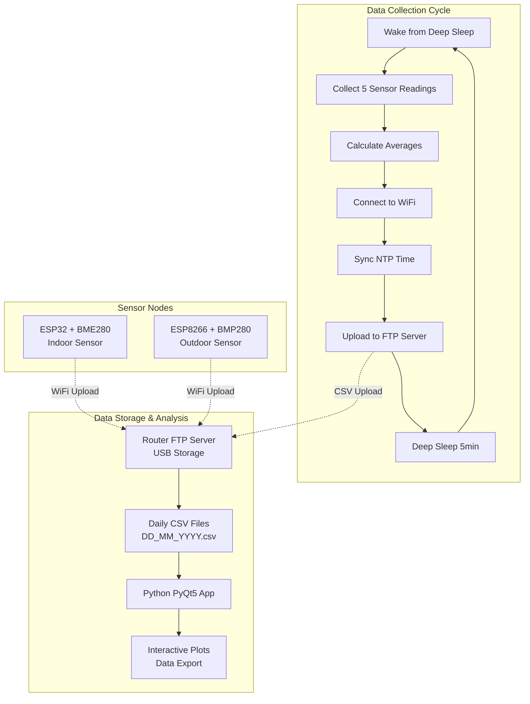

# RoutineTimer - Environmental Monitoring System


A complete IoT environmental monitoring solution consisting of ESP32/ESP8266-based sensor nodes and a Python visualization application. This system provides long-term environmental data collection with minimal power consumption and comprehensive data analysis capabilities.

## Overview

This project implements a low-power environmental monitoring system that:
- **Dual Platform Support**: ESP32 with BME280 (temperature, humidity, pressure) and ESP8266 with BMP280 (temperature, pressure)
- **Smart Power Management**: Deep sleep cycles (5-minute intervals) for weeks/months of battery operation
- **Robust Data Upload**: FTP-based data storage with retry mechanisms and error handling
- **Professional Visualization**: PyQt5 desktop application with interactive time-series plotting
- **Router-Based Storage**: Utilizes router USB ports for cost-effective, always-on data storage

## System Architecture




## Multi-Platform Support

See Hardware Requirements below for board, sensor, and wiring details for ESP32 (indoor) and ESP8266 (outdoor) configurations. File naming conventions and power notes are also summarized there.


## Hardware Requirements

- ESP32 (Denky32/WROOM-32) + BME280 (SDA=21, SCL=22, 3.3V)
- ESP8266 (NodeMCU v2) + BMP280 (SDA=D1/GPIO5, SCL=D2/GPIO4, 3.3V)
- Battery or USB power (see Power Consumption section)
- WiFi network, router with USB/FTP, USB storage device


## Software Requirements

- PlatformIO IDE (or Arduino IDE) for firmware
- ESP32/ESP8266 Arduino framework, Adafruit BME280/BMP280 libraries
- Python 3.7+ with pip, see `graph/requirements.txt` for dependencies
- Router with FTP server and USB storage

## Quick Start

### 1. Hardware Setup
```bash
# ESP32 (Indoor) - BME280 Connections
VCC  → 3.3V
GND  → GND  
SDA  → GPIO21
SCL  → GPIO22

# ESP8266 (Outdoor) - BMP280 Connections  
VCC  → 3.3V
GND  → GND
SDA  → D1 (GPIO5)
SCL  → D2 (GPIO4)
```

### 2. Configure and Flash Firmware
```bash
# Open project in PlatformIO IDE
# Select target environment:
#   - "wroom32" for ESP32 + BME280
#   - "nodemcuv2" for ESP8266 + BMP280

# Edit WiFi and FTP credentials in src/main.cpp as shown in the Configuration section below.
# Build and upload firmware
pio run --target upload
```

### 3. Setup Router FTP Server
1. Connect USB storage device to router
2. Enable FTP server in router admin panel
3. Configure FTP user credentials
4. Test FTP access from computer

### 4. Launch Data Visualization
```bash
# Windows - Double-click batch file
run_plotter.bat

# Manual setup (any OS)
cd graph
python -m venv .venv
.venv\Scripts\activate          # Windows
source .venv/bin/activate       # Linux/Mac
pip install -r requirements.txt
python environmental_plotter.py
```

## Configuration

### Configuration Reference (src/main.cpp)
All key configuration parameters (WiFi, FTP, sensor timing, NTP) are defined at the top of `src/main.cpp`. Please refer to that file for the latest settings and update as needed. Example parameters include:

- WiFi credentials: `WIFI_SSID`, `WIFI_PASSWORD`, `WIFI_TIMEOUT`
- FTP server: `FTP_SERVER`, `FTP_PORT`, `FTP_USER`, `FTP_PASSWORD`, `FTP_BASE_PATH`
- Sensor timing: `SLEEP_TIME_US`, `READINGS_PER_CYCLE`, `READING_INTERVAL`
- NTP: `NTP_SERVER`, `GMT_OFFSET_SEC`

See comments in `src/main.cpp` for details and adjust values for your deployment.

### PlatformIO Build Targets
```ini
# ESP32 Indoor Sensor (BME280)
[env:wroom32]
build_flags = 
    -DUSE_BME280=1
    -DFILENAME_SUFFIX=\"\"

# ESP8266 Outdoor Sensor (BMP280)  
[env:nodemcuv2]
build_flags = 
    -DUSE_BMP280=1
    -DFILENAME_SUFFIX=\"_outside\"
```

## Design Choice: FTP vs Dedicated Server

This project uses FTP for data storage instead of a dedicated server setup. The reason is simple and practical: many modern routers support USB storage, allowing you to plug in a USB stick and instantly have FTP server functionality. This approach offers several advantages:

- **Cost-effective**: No need for a separate server or cloud service
- **Always available**: Router-based storage is always on with your network
- **Simple setup**: Most routers have built-in FTP server functionality
- **Local control**: All data stays within your local network
- **Minimal power consumption**: USB stick consumes negligible power

In this implementation, a leftover USB stick plugged into the router provides reliable, 24/7 data storage without additional hardware costs or complexity.

## Data Format & Storage

### CSV File Structure
Daily CSV files are automatically created with platform-specific naming:
- **ESP32 Indoor**: `DD_MM_YYYY.csv`
- **ESP8266 Outdoor**: `DD_MM_YYYY_outside.csv`

### CSV Format
```csv
Date,Sample Size,Temp (°C),Pressure (hPa),Humidity (RH%)
29/07/2025 14:30,5,25.2,1013.2,65.50
29/07/2025 14:35,5,25.1,1013.1,65.30
```

### Data Collection Process
1. **Wake Cycle**: Device wakes every 5 minutes from deep sleep
2. **Sensor Sampling**: Collects 5 readings over 15 seconds (3-second intervals)
3. **Averaging**: Calculates mean values from valid readings
4. **Upload**: Appends averaged data to daily CSV file via FTP
5. **Sleep**: Returns to deep sleep for power conservation

### Storage Organization
```
USB_Storage/
├── 31_07_2025.csv          # ESP32 indoor data
├── 31_07_2025_outside.csv  # ESP8266 outdoor data  
├── 01_08_2025.csv          # Next day indoor
└── 01_08_2025_outside.csv  # Next day outdoor
```

## Power Consumption & Battery Life

### ESP32 Power Profile
- **Active Operation**: ~150-250mA for 30-40 seconds per cycle
- **Deep Sleep**: <10μA between cycles (WiFi/Bluetooth disabled)
- **Daily Data Points**: 288 uploads (every 5 minutes)
- **Estimated Battery Life**: 
  - 18650 Li-ion (3000mAh): 3-6 months
  - 6xAA NiMH (2500mAh): 2-4 months

### ESP8266 Power Profile  
- **Active Operation**: ~120-200mA for 25-35 seconds per cycle
- **Deep Sleep**: <20μA between cycles
- **Daily Data Points**: 288 uploads (every 5 minutes)
- **Estimated Battery Life**:
  - 18650 Li-ion (3000mAh): 4-8 months
  - 4xAA NiMH (2500mAh): 2-5 months

### Power Optimization Features
- Bluetooth completely disabled on ESP32
- WiFi module powered down during sleep
- Efficient sensor sampling with minimal warm-up time
- Optimized FTP upload with connection reuse
- Hardware-level deep sleep implementation


## Project Structure

See the repository tree for a full breakdown. Main components:
- `src/` (firmware), `graph/` (visualization app), `platformio.ini` (build config), documentation, and test/lib/include folders.


## Key Features

- Dual platform firmware (ESP32/ESP8266) with robust sensor, WiFi, and FTP handling
- Power-optimized, reliable data collection and upload
- PyQt5 visualization app: interactive plots, export, multi-threaded FTP, and error handling


## Troubleshooting

See comments in `src/main.cpp` and serial/console output for detailed troubleshooting. Common issues:
- Sensor not detected: check I2C wiring, addresses, and power (3.3V only)
- WiFi/FTP: verify credentials, router/server status, and network connectivity
- Python/visualization: ensure Python 3.7+, install dependencies, check CSV format


## Development & Customization

See code comments and examples in `src/main.cpp`, `platformio.ini`, and `graph/environmental_plotter.py` for how to:
- Add new sensor types (update libraries, initialization, CSV format)
- Extend visualization (add columns/plots, update requirements)
- Customize build targets and advanced features


## License & Contributing

This project is open source under the **Apache License 2.0**. You are free to use, modify, and distribute it (see LICENSE for details).

