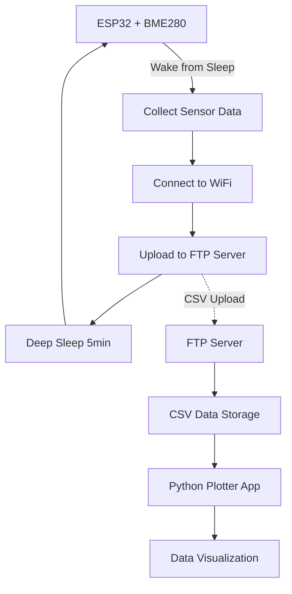

# RoutineTimer - Environmental Monitoring System


A complete IoT environmental monitoring solution consisting of an ESP32-based sensor node and a Python visualization application.

## Overview

This project implements a low-power environmental monitoring system that:
- Collects temperature, humidity, and pressure data using BME280 sensor
- Uploads data to FTP server over WiFi
- Operates on deep sleep cycles for extended battery life
- Provides data visualization through a desktop application

## System Architecture



## Components

### 1. ESP32 Firmware
- **Platform**: ESP32 (PlatformIO)
- **Sensor**: BME280 (Temperature, Humidity, Pressure)
- **Connectivity**: WiFi + FTP Client
- **Power Management**: Deep sleep between readings

### 2. Data Visualization
- **Language**: Python with PyQt5 GUI
- **Features**: FTP data download, time series plotting, CSV export
- **Charts**: Temperature, humidity, pressure trends

## Hardware Requirements

- ESP32 development board (Denky32 or compatible)
- BME280 environmental sensor
- I2C connections (SDA: GPIO21, SCL: GPIO22)
- WiFi network access
- FTP server for data storage

## Software Requirements

### ESP32 Firmware
- PlatformIO IDE
- ESP32 Arduino framework
- Libraries:
  - Adafruit BME280 Library
  - Adafruit Unified Sensor

### Data Plotter
- Python 3.7+
- Dependencies (auto-installed):
  - matplotlib
  - pandas
  - PyQt5
  - python-dateutil

## Quick Start

### 1. Flash ESP32 Firmware
```bash
# Open project in PlatformIO
# Configure WiFi credentials in main.cpp
# Upload to ESP32 board
```

### 2. Run Data Plotter
```bash
# Windows
run_plotter.bat

# Manual setup
cd graph
python -m venv .venv
.venv\Scripts\activate
pip install -r requirements.txt
python environmental_plotter.py
```

## Configuration

### WiFi Settings (main.cpp)
```cpp
const char* WIFI_SSID = "Your_WiFi_Network";
const char* WIFI_PASSWORD = "Your_Password";
```

### FTP Settings (main.cpp)
```cpp
const char* FTP_SERVER = "192.168.1.1";
const char* FTP_USER = "admin";
const char* FTP_PASSWORD = "your_password";
const char* FTP_BASE_PATH = "/data/";
```

## Design Choice: FTP vs Dedicated Server

This project uses FTP for data storage instead of a dedicated server setup. The reason is simple and practical: many modern routers support USB storage, allowing you to plug in a USB stick and instantly have FTP server functionality. This approach offers several advantages:

- **Cost-effective**: No need for a separate server or cloud service
- **Always available**: Router-based storage is always on with your network
- **Simple setup**: Most routers have built-in FTP server functionality
- **Local control**: All data stays within your local network
- **Minimal power consumption**: USB stick consumes negligible power

In this implementation, a leftover USB stick plugged into the router provides reliable, 24/7 data storage without additional hardware costs or complexity.

## Data Format

CSV files are created daily with format: `DD_MM_YYYY.csv`

```csv
Date,Sample Size,Temp (°C),Pressure (hPa),Humidity (RH%)
29/07/2025 14:30,5,25.2,1013.2,65.50
```

## Power Consumption

- **Active time**: ~30 seconds per cycle
- **Sleep time**: 5 minutes between cycles
- **Daily uploads**: 288 data points
- **Battery life**: Weeks to months (depends on battery capacity)

## File Structure

```
RoutineTimer/
├── README.md                 # This file
├── platformio.ini           # PlatformIO configuration
├── run_plotter.bat         # Windows launcher for plotter
├── src/
│   ├── main.cpp            # ESP32 main application
│   ├── FTPClient.cpp       # FTP client implementation
│   └── FTPClient.h         # FTP client header
├── graph/
│   ├── environmental_plotter.py  # Data visualization app
│   ├── requirements.txt    # Python dependencies
│   └── README.md          # Plotter documentation
├── include/                # Header files
├── lib/                   # Project libraries
└── test/                  # Test files
```

## Features

### ESP32 Firmware
- Automatic sensor initialization with fallback addresses
- Robust WiFi connection with timeout handling
- NTP time synchronization
- FTP upload with retry mechanism
- Power optimization (Bluetooth disabled, WiFi managed)
- Comprehensive error handling and logging

### Data Plotter
- FTP server connection and file download
- Interactive date range selection
- Real-time data plotting with multiple metrics
- Data export functionality
- Progress tracking and error handling

## Troubleshooting

### ESP32 Issues
- Check BME280 I2C connections and addresses
- Verify WiFi credentials and network access
- Ensure FTP server is accessible and credentials are correct
- Monitor serial output for debugging information

### Plotter Issues
- Verify Python installation and dependencies
- Check FTP server settings in the application
- Ensure network connectivity to FTP server
- Review console output for error details

## Development

### Adding New Sensors
1. Include sensor library in `platformio.ini`
2. Initialize sensor in `setup()`
3. Add readings to `collectSensorReadings()`
4. Update CSV format in `uploadDataToFTP()`

### Extending Visualization
1. Modify `environmental_plotter.py`
2. Update data parsing for new columns
3. Add new plot types as needed
4. Update requirements if new libraries are needed

## License

This project is open source. Feel free to modify and distribute according to your needs.
