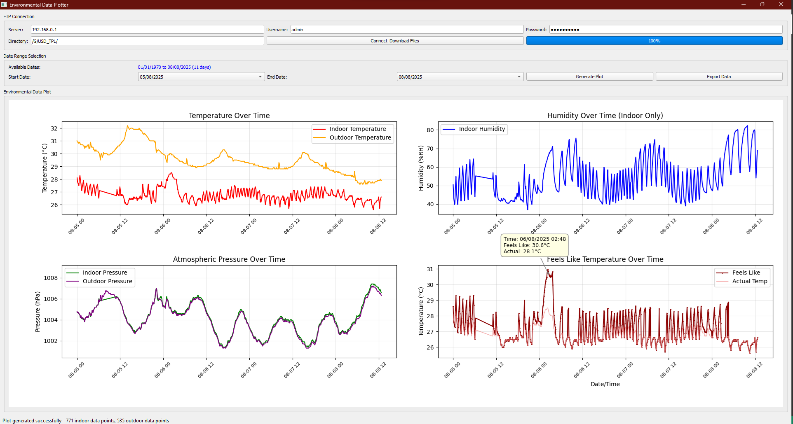
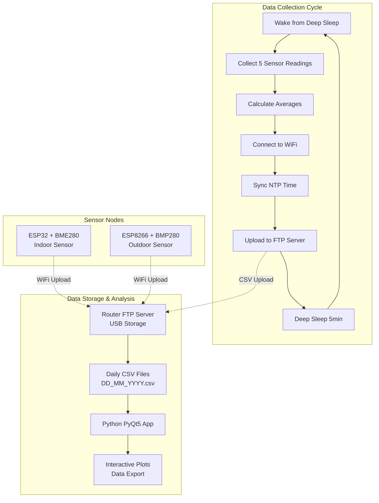

# RoutineTimer - Environmental Monitoring System



A complete IoT environmental monitoring solution consisting of ESP32/ESP8266-based sensor nodes and a Python visualization application. This system provides long-term environmental data collection with minimal power consumption and comprehensive data analysis capabilities.

## Overview

This project implements a low-power environmental monitoring system that:
- **Dual Platform Support**: ESP32 with BME280 (temperature, humidity, pressure) and ESP8266 with BMP280 (temperature, pressure)
- **Smart Power Management**: Deep sleep cycles (5-minute intervals) for weeks/months of battery operation
- **Robust Data Upload**: FTP-based data storage with retry mechanisms and error handling
- **Professional Visualization**: PyQt5 desktop application with interactive time-series plotting
- **Router-Based Storage**: Utilizes router USB ports for cost-effective, always-on data storage

## System Architecture



## Multi-Platform Support

### ESP32 Configuration (Indoor Sensor)
- **Board**: Denky32 or compatible ESP32
- **Sensor**: BME280 (Temperature, Humidity, Pressure)
- **I2C Pins**: SDA=21, SCL=22
- **File Naming**: `DD_MM_YYYY.csv` (no suffix)
- **Power**: USB or battery with deep sleep optimization

### ESP8266 Configuration (Outdoor Sensor)
- **Board**: NodeMCU v2 or compatible ESP8266
- **Sensor**: BMP280 (Temperature, Pressure only)
- **I2C Pins**: SDA=5 (D1), SCL=4 (D2)
- **File Naming**: `DD_MM_YYYY_outside.csv` (outdoor suffix)
- **Power**: Battery optimized for outdoor deployment

## Hardware Requirements

### ESP32 Indoor Setup
- ESP32 development board (Denky32 or WROOM-32 compatible)
- BME280 environmental sensor breakout
- I2C connections: SDA → GPIO21, SCL → GPIO22
- 3.3V power supply (USB or battery pack)

### ESP8266 Outdoor Setup  
- ESP8266 NodeMCU v2 development board
- BMP280 sensor breakout (weather-resistant housing recommended)
- I2C connections: SDA → D1 (GPIO5), SCL → D2 (GPIO4)
- Battery pack with weather protection

### Network Infrastructure
- WiFi network with internet access for NTP synchronization
- Router with USB port and FTP server capability
- USB storage device (flash drive recommended for reliability)

## Software Requirements

### Firmware Development
- **PlatformIO IDE** (recommended) or Arduino IDE
- ESP32/ESP8266 Arduino framework
- Platform-specific libraries:
  - **ESP32**: Adafruit BME280 Library, Adafruit Unified Sensor
  - **ESP8266**: Adafruit BMP280 Library, Adafruit Unified Sensor

### Data Visualization Application
- **Python 3.7+** with pip package manager
- **Auto-installed dependencies**:
  - `matplotlib>=3.7.0` - Plotting and visualization
  - `pandas>=2.0.0` - Data manipulation and analysis
  - `PyQt5>=5.15.0` - GUI framework
  - `python-dateutil>=2.8.0` - Date/time parsing

### Network Infrastructure
- Router with built-in FTP server (most modern routers)
- USB storage device connected to router
- Stable WiFi network with internet connectivity

## Quick Start

### 1. Hardware Setup
```bash
# ESP32 (Indoor) - BME280 Connections
VCC  → 3.3V
GND  → GND  
SDA  → GPIO21
SCL  → GPIO22

# ESP8266 (Outdoor) - BMP280 Connections  
VCC  → 3.3V
GND  → GND
SDA  → D1 (GPIO5)
SCL  → D2 (GPIO4)
```

### 2. Configure and Flash Firmware
```bash
# Open project in PlatformIO IDE
# Select target environment:
#   - "wroom32" for ESP32 + BME280
#   - "nodemcuv2" for ESP8266 + BMP280

# Edit WiFi credentials in src/main.cpp:
const char* WIFI_SSID = "Your_WiFi_Network";
const char* WIFI_PASSWORD = "Your_Password";

# Edit FTP settings in src/main.cpp:
const char* FTP_SERVER = "192.168.1.1";        # Your router IP
const char* FTP_USER = "admin";                 # FTP username  
const char* FTP_PASSWORD = "your_password";     # FTP password
const char* FTP_BASE_PATH = "/USB_Storage/";    # USB mount path

# Build and upload firmware
pio run --target upload
```

### 3. Setup Router FTP Server
1. Connect USB storage device to router
2. Enable FTP server in router admin panel
3. Configure FTP user credentials
4. Test FTP access from computer

### 4. Launch Data Visualization
```bash
# Windows - Double-click batch file
run_plotter.bat

# Manual setup (any OS)
cd graph
python -m venv .venv
.venv\Scripts\activate          # Windows
source .venv/bin/activate       # Linux/Mac
pip install -r requirements.txt
python environmental_plotter.py
```

## Configuration

### WiFi Settings (src/main.cpp)
```cpp
const char* WIFI_SSID = "Your_WiFi_Network";
const char* WIFI_PASSWORD = "Your_Password";
const unsigned long WIFI_TIMEOUT = 10000;       // 10 second timeout
```

### FTP Settings (src/main.cpp)
```cpp
const char* FTP_SERVER = "192.168.1.1";         // Router IP address
const int FTP_PORT = 21;                         // Standard FTP port
const char* FTP_USER = "admin";                  // FTP username
const char* FTP_PASSWORD = "your_password";      // FTP password  
const char* FTP_BASE_PATH = "/USB_Storage/";     // Storage path on router
```

### Sensor Configuration (src/main.cpp)
```cpp
// Data collection timing
const uint64_t SLEEP_TIME_US = 5 * 60 * 1000000ULL;  // 5 minutes between cycles
const int READINGS_PER_CYCLE = 5;                     // Readings per wake cycle
const unsigned long READING_INTERVAL = 3000;          // 3 seconds between readings

// NTP time synchronization
const char* NTP_SERVER = "time.google.com";
const long GMT_OFFSET_SEC = 5.5 * 3600;               // IST UTC+5:30 (adjust for your timezone)
```

### PlatformIO Build Targets
```ini
# ESP32 Indoor Sensor (BME280)
[env:wroom32]
build_flags = 
    -DUSE_BME280=1
    -DFILENAME_SUFFIX=\"\"

# ESP8266 Outdoor Sensor (BMP280)  
[env:nodemcuv2]
build_flags = 
    -DUSE_BMP280=1
    -DFILENAME_SUFFIX=\"_outside\"
```

## Design Choice: Router-Based FTP Storage

This project uses FTP storage via router USB ports instead of dedicated servers or cloud services. This design choice offers several practical advantages:

### Why Router FTP?
- **Zero Additional Cost**: Most modern routers support USB storage with built-in FTP
- **24/7 Availability**: Router-based storage is always online with your network
- **Local Data Control**: All environmental data stays within your local network
- **Minimal Power Consumption**: USB storage adds negligible power draw
- **Simple Setup**: No server installation or cloud subscriptions required
- **High Reliability**: Consumer routers are designed for continuous operation

### Implementation Benefits
- **Automatic Failover**: Router handles USB device mounting and FTP service
- **Network Integration**: FTP server shares router's network configuration
- **Multiple Device Support**: Both ESP32 and ESP8266 can upload to same storage
- **Data Persistence**: USB storage survives power outages and router reboots

### Recommended Setup
1. Use high-quality USB 3.0 flash drive (SSD for heavy usage)
2. Format storage as FAT32 or ext4 (router dependent)
3. Enable FTP service in router admin panel
4. Create dedicated user account for sensor uploads
5. Set appropriate directory permissions for data folder

This approach transforms any unused USB stick into a reliable IoT data repository without additional infrastructure costs.

## Data Format & Storage

### CSV File Structure
Daily CSV files are automatically created with platform-specific naming:
- **ESP32 Indoor**: `DD_MM_YYYY.csv`
- **ESP8266 Outdoor**: `DD_MM_YYYY_outside.csv`

### CSV Format
```csv
Date,Sample Size,Temp (°C),Pressure (hPa),Humidity (RH%)
29/07/2025 14:30,5,25.2,1013.2,65.50
29/07/2025 14:35,5,25.1,1013.1,65.30
```

### Data Collection Process
1. **Wake Cycle**: Device wakes every 5 minutes from deep sleep
2. **Sensor Sampling**: Collects 5 readings over 15 seconds (3-second intervals)
3. **Averaging**: Calculates mean values from valid readings
4. **Upload**: Appends averaged data to daily CSV file via FTP
5. **Sleep**: Returns to deep sleep for power conservation

### Storage Organization
```
USB_Storage/
├── 31_07_2025.csv          # ESP32 indoor data
├── 31_07_2025_outside.csv  # ESP8266 outdoor data  
├── 01_08_2025.csv          # Next day indoor
└── 01_08_2025_outside.csv  # Next day outdoor
```

## Power Consumption & Battery Life

### ESP32 Power Profile
- **Active Operation**: ~150-250mA for 30-40 seconds per cycle
- **Deep Sleep**: <10μA between cycles (WiFi/Bluetooth disabled)
- **Daily Data Points**: 288 uploads (every 5 minutes)
- **Estimated Battery Life**: 
  - 18650 Li-ion (3000mAh): 3-6 months
  - 6xAA NiMH (2500mAh): 2-4 months

### ESP8266 Power Profile  
- **Active Operation**: ~120-200mA for 25-35 seconds per cycle
- **Deep Sleep**: <20μA between cycles
- **Daily Data Points**: 288 uploads (every 5 minutes)
- **Estimated Battery Life**:
  - 18650 Li-ion (3000mAh): 4-8 months
  - 4xAA NiMH (2500mAh): 2-5 months

### Power Optimization Features
- Bluetooth completely disabled on ESP32
- WiFi module powered down during sleep
- Efficient sensor sampling with minimal warm-up time
- Optimized FTP upload with connection reuse
- Hardware-level deep sleep implementation

## Project Structure

```
RoutineTimer/
├── README.md                     # Project documentation (this file)
├── HLD.md                       # High-Level Design document  
├── LLD.md                       # Low-Level Design document
├── LICENSE                      # Project license
├── platformio.ini              # PlatformIO configuration (dual-platform)
├── run_plotter.bat            # Windows launcher for visualization app
├── screenshot.png             # Application screenshot
│
├── src/                       # ESP32/ESP8266 firmware source
│   ├── main.cpp               # Main application logic
│   ├── FTPClient.h           # FTP client class header
│   └── FTPClient.cpp         # FTP client implementation
│
├── graph/                     # Python visualization application
│   ├── environmental_plotter.py  # Main PyQt5 application
│   ├── requirements.txt       # Python dependencies
│   ├── README.md             # Plotter-specific documentation
│   └── __pycache__/          # Python compiled cache
│
├── include/                   # Additional header files (if needed)
├── lib/                      # Project-specific libraries
└── test/                     # Unit tests and test utilities
```

## Key Features

### Firmware Capabilities
- **Dual Platform Support**: Single codebase for ESP32 (BME280) and ESP8266 (BMP280)
- **Robust Sensor Initialization**: Multiple I2C address attempts with fallback handling
- **Intelligent WiFi Management**: Connection timeout with automatic retry logic
- **Precise Time Synchronization**: NTP-based timestamping with timezone support
- **Advanced FTP Client**: Custom implementation with passive mode and retry mechanisms
- **Comprehensive Error Handling**: Graceful degradation with detailed serial logging
- **Power Optimization**: Hardware-level sleep management and peripheral control

### Visualization Application
- **Professional GUI**: PyQt5-based interface with intuitive controls
- **Multi-threaded Operations**: Background FTP downloads without GUI blocking
- **Interactive Date Selection**: Calendar-based date range picker
- **Multi-metric Plotting**: Temperature, humidity, pressure, and sample size graphs
- **Data Export Functionality**: CSV export for external analysis
- **Comprehensive Logging**: Detailed console output for troubleshooting
- **Progress Tracking**: Real-time feedback during data operations
- **Error Recovery**: Robust exception handling with user-friendly messages

## Troubleshooting

### Firmware Issues

#### Sensor Detection Problems
```bash
# Check I2C connections and addresses
# ESP32: SDA=21, SCL=22  |  ESP8266: SDA=5, SCL=4
# Monitor serial output for I2C scan results
# Verify 3.3V power supply (NOT 5V)
# Try different I2C addresses (0x76, 0x77)
```

#### WiFi Connection Failures
```bash
# Verify SSID and password in main.cpp
# Check WiFi signal strength at sensor location
# Ensure 2.4GHz network (ESP8266 doesn't support 5GHz)
# Monitor serial output for connection attempts
# Test manual connection from computer at same location
```

#### FTP Upload Errors
```bash
# Verify router FTP server is enabled
# Test FTP credentials using desktop FTP client
# Check router USB storage mount status
# Ensure FTP_BASE_PATH exists on router storage
# Monitor serial output for detailed FTP error messages
```

### Visualization Application Issues

#### Python Environment Problems
```bash
# Ensure Python 3.7+ is installed
python --version

# Recreate virtual environment if corrupted
rmdir /s .venv
python -m venv .venv
.venv\Scripts\activate
pip install -r requirements.txt
```

#### FTP Connection Issues  
```bash
# Test router FTP access from command line
ftp 192.168.1.1
# Enter username/password to verify credentials
# Check if data directory is accessible

# Verify network connectivity
ping 192.168.1.1
```

#### Data Parsing Errors
```bash
# Check CSV file format on router storage
# Ensure files are not corrupted during transfer
# Verify date/time format matches expected pattern
# Check for special characters in data files
```

### Hardware Debugging

#### Power Issues
- Measure actual battery voltage under load
- Check for loose connections affecting power delivery
- Verify current consumption matches expected values
- Test with USB power supply to isolate battery issues

#### Sensor Accuracy
- Compare readings with reference instruments
- Allow adequate warm-up time after power-on
- Check for environmental interference (heat sources, air flow)
- Verify sensor mounting doesn't affect readings

## Development & Customization

### Adding New Sensor Types
```cpp
// 1. Include sensor library in platformio.ini
lib_deps = 
    your_sensor_library

// 2. Initialize sensor in setup()
if (!newSensor.begin()) {
    Serial.println("New sensor initialization failed");
    return false;
}

// 3. Add readings to collectSensorReadings()
float newReading = newSensor.readValue();
if (!isnan(newReading)) {
    newSum += newReading;
}

// 4. Update CSV format in uploadDataToFTP()
String csvData = getCurrentTimeString() + "," + 
                String(sampleCount) + "," +
                String(avgTemp, 1) + "," +
                String(avgPressure, 1) + "," + 
                String(avgHumidity, 2) + "," +
                String(avgNewReading, 2) + "\r\n";
```

### Extending Visualization
```python
# 1. Update CSV parsing in environmental_plotter.py
required_cols = ['Date', 'Sample Size', 'Temp (°C)', 
                'Pressure (hPa)', 'Humidity (RH%)', 'New Metric']

# 2. Add new plot subplot
axes[2,0].plot(filtered_data['Date'], 
               filtered_data['New Metric'], 'c-', linewidth=1)
axes[2,0].set_title('New Metric (units)')
axes[2,0].grid(True, alpha=0.3)

# 3. Update requirements.txt if new libraries needed
your_new_library>=1.0.0
```

### Platform Customization
```ini
# Add new platform in platformio.ini
[env:your_board]
platform = your_platform  
board = your_board_type
framework = arduino
build_flags = 
    -DUSE_YOUR_SENSOR=1
    -DFILENAME_SUFFIX=\"_your_suffix\"
    -DSDA_PIN=your_sda_pin
    -DSCL_PIN=your_scl_pin
lib_deps = 
    your_sensor_library
```

### Advanced Configuration
- **Custom Sleep Intervals**: Modify `SLEEP_TIME_US` in main.cpp
- **Data Retention**: Implement automatic old file deletion
- **Multiple Sensors**: Deploy multiple nodes with different suffixes
- **Web Interface**: Replace PyQt5 with web-based dashboard
- **Database Storage**: Replace FTP with proper database backend
- **Cloud Integration**: Add MQTT or cloud service connectivity

## License & Contributing

This project is open source and available under the **Apache License 2.0**. You are free to:
- Use the software for any purpose, including commercial use
- Distribute and modify the software
- Distribute modified versions under the same license
- Include the software in larger works under different licenses

### Contributing Guidelines
1. **Code Standards**: Follow existing code style and documentation patterns
2. **Multi-Platform Testing**: Test changes on both ESP32 and ESP8266 platforms  
3. **Documentation**: Update all relevant documentation for new features
4. **Example Configurations**: Include sample configurations for new sensors
5. **Backward Compatibility**: Maintain compatibility with existing data formats

### How to Contribute
1. Fork the repository on GitHub
2. Create a feature branch (`git checkout -b feature/amazing-feature`)
3. Commit your changes (`git commit -m 'Add amazing feature'`)
4. Push to the branch (`git push origin feature/amazing-feature`)
5. Open a Pull Request with detailed description

## Project History & Evolution

**RoutineTimer v1.0** (Original): Single ESP32 sensor for basic data collection
**RoutineTimer v2.0** (Current): Multi-platform IoT system with professional visualization

### Key Milestones:
- **2024**: Initial ESP32 + BME280 implementation with basic FTP upload
- **2025**: Added ESP8266 + BMP280 support for outdoor monitoring
- **2025**: Developed professional PyQt5 visualization application
- **2025**: Enhanced FTP client with robust error handling and retry logic
- **2025**: Comprehensive documentation and troubleshooting guides

### Technical Evolution:
- Single-platform → Dual-platform support (ESP32/ESP8266)
- Basic sensor reading → Advanced averaging and validation
- Simple FTP upload → Robust passive-mode FTP client with retry logic
- Terminal plotting → Professional GUI with interactive controls
- Limited documentation → Comprehensive HLD/LLD documentation

## Community & Support

### Getting Help
- **Documentation**: Start with README.md, HLD.md, and LLD.md
- **Troubleshooting**: Check troubleshooting sections in documentation
- **Issues**: Open GitHub issues for bugs and feature requests
- **Discussions**: Use GitHub Discussions for general questions

### Real-World Deployments
This system has been successfully deployed for:
- **Indoor Air Quality Monitoring**: Office and home environments
- **Outdoor Weather Stations**: Garden and agricultural monitoring  
- **HVAC System Analysis**: Building management applications
- **Research Projects**: Environmental data collection for studies

### Performance Statistics
- **Battery Life**: 3-8 months on single charge (typical usage)
- **Data Reliability**: >95% successful uploads with retry mechanism
- **Storage Efficiency**: ~1MB per month of continuous 5-minute interval data
- **Network Resilience**: Automatic recovery from temporary WiFi outages

## Acknowledgments

- **Adafruit**: BME280 and BMP280 sensor libraries
- **PyQt5 Team**: Cross-platform GUI framework
- **Matplotlib/Pandas**: Python data analysis ecosystem
- **PlatformIO**: Arduino-compatible development platform
- **ESP32/ESP8266 Community**: Hardware platform support and examples
